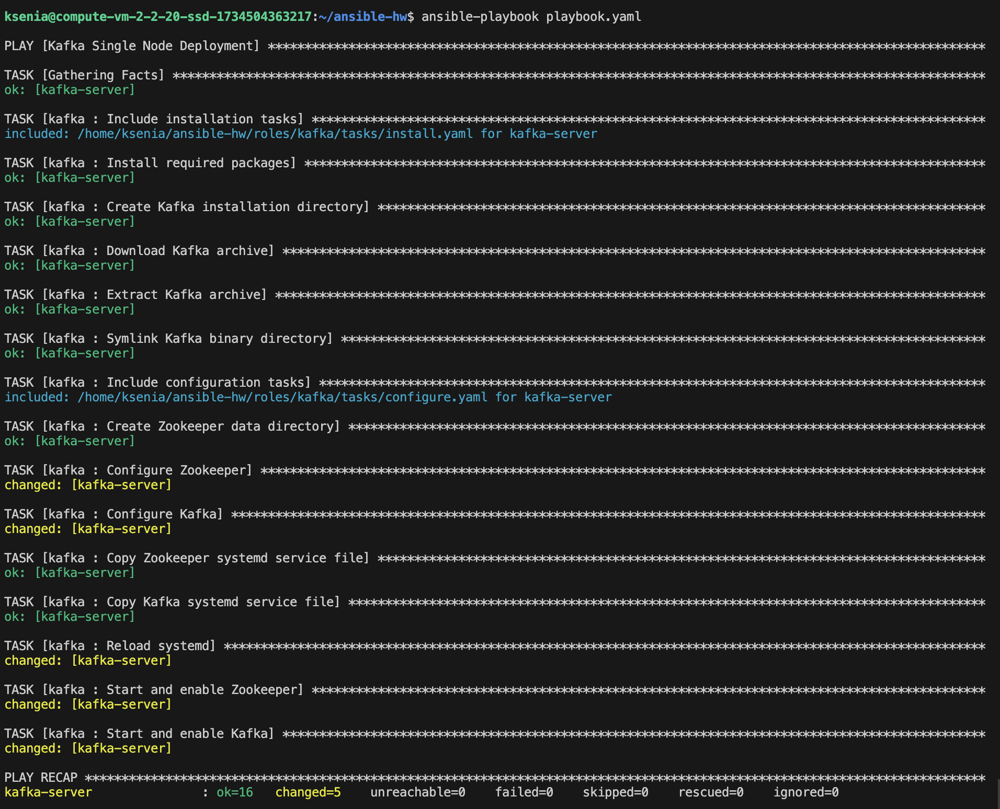
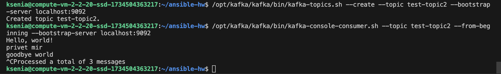
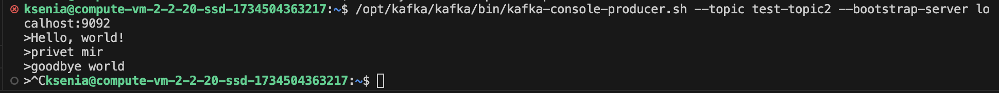

# Ansible Homework

Для выполнения работы была создана роль kafka, которая состоит из двух этапов: установки и конфигурации.
На этапе установки скачивается архив кафки и распаковывается, а также создается симлинк.
На этапе конфигурации берутся небходимые конфиги для работы Зукипера и Кафки.

